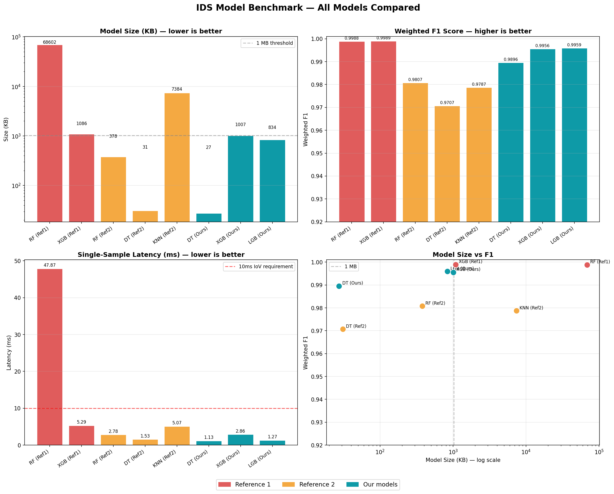

# Efficient Machine Learning for Network Intrusion Detection

This repository contains an efficiency-aware machine learning project for network intrusion detection using the CICIDS2017 dataset. The goal is to evaluate whether compact machine learning models can maintain strong intrusion detection performance while reducing computational cost for practical deployment.

The project focuses on both classification performance and deployment practicality. In addition to accuracy and F1-score, the models are evaluated using model size, inference latency, throughput, memory usage, and training time.

## Project Overview

Network intrusion detection systems are used to identify malicious or abnormal traffic in computer networks. Many machine learning intrusion detection studies focus mainly on classification accuracy, but real-world IDS deployment also depends on computational constraints.

In practical environments such as routers, network monitoring appliances, edge devices, and embedded systems, an IDS model must be accurate, but it must also be small, fast, and efficient.

This project compares several machine learning models for multiclass intrusion detection and studies the trade-off between predictive performance and computational efficiency.

## Research Goal

The main research question is:

> Which machine learning model provides strong intrusion detection performance while remaining efficient enough for practical deployment?

To answer this, the project compares models using both classification metrics and efficiency metrics.

## Dataset

This project uses the CICIDS2017 dataset, a labeled network intrusion detection dataset containing benign traffic and multiple attack types.

Official dataset source:

https://www.unb.ca/cic/datasets/ids-2017.html

The raw and processed dataset files are not included in this repository because they exceed GitHub's standard file size limits. To reproduce the project, download the CICIDS2017 CSV files from the official source and place them in a local `raw_data/` directory.

## Dataset Files Not Included

The following folders are intentionally excluded from version control:

```text
raw_data/
merged/
features/
```

These folders may contain large raw, cleaned, or feature-selected CSV files. They are generated locally by running the notebooks.

## Class Labels

After preprocessing, the original CICIDS2017 labels were consolidated into broader intrusion detection categories:

- Normal
- Bot
- Brute Force
- DDoS
- DoS
- Port Scanning
- Web Attack

This consolidation creates a cleaner multiclass classification problem while preserving the major attack categories in the dataset.

## Repository Structure

```text
.
├── notebooks/
│   ├── ids-data-processing.ipynb
│   ├── ids_feature_engineering.ipynb
│   └── ids_model_training.ipynb
├── results/
│   ├── your_benchmarks.json
│   └── benchmark_comparison.png
├── README.md
├── requirements.txt
└── .gitignore
```

## Notebook Workflow

Run the notebooks in the following order:

```text
1. notebooks/ids-data-processing.ipynb
2. notebooks/ids_feature_engineering.ipynb
3. notebooks/ids_model_training.ipynb
```

### 1. Data Processing

The data processing notebook prepares the raw CICIDS2017 CSV files for machine learning.

Main steps include:

- Loading and merging CICIDS2017 CSV files
- Cleaning missing and infinite values
- Removing invalid flow-duration rows
- Removing duplicate rows
- Dropping zero-variance columns
- Removing identical or redundant columns
- Downcasting numeric columns to reduce memory usage
- Saving the cleaned dataset locally

### 2. Feature Engineering

The feature engineering notebook reduces the feature space and prepares the final modeling dataset.

Main steps include:

- Consolidating attack labels
- Removing rare or unusable classes where needed
- Applying correlation filtering
- Ranking features statistically
- Comparing model-based feature importance
- Selecting a compact final feature set

The final models were trained using 10 selected network-flow features.

### 3. Model Training and Benchmarking

The model training notebook trains and evaluates the final IDS models.

Main steps include:

- Splitting the dataset into training and testing sets
- Handling class imbalance during training
- Training baseline and optimized models
- Tuning boosted models with Optuna
- Evaluating classification performance
- Benchmarking model size, latency, throughput, memory usage, and training time

## Models Evaluated

The following models were evaluated:

- Decision Tree
- XGBoost
- LightGBM

The Decision Tree model serves as a lightweight baseline. XGBoost and LightGBM are optimized gradient-boosting models used to compare stronger predictive performance against computational cost.

## Evaluation Metrics

Models were evaluated using two categories of metrics.

### Classification Metrics

- Accuracy
- Precision
- Recall
- Weighted F1-score
- Per-class F1-score

### Efficiency Metrics

- Model size
- Single-sample inference latency
- 95th-percentile inference latency
- Batch inference time
- Throughput
- Peak inference memory usage
- Training time

Throughput is reported in samples per second. In the benchmark table, `M` means million samples per second and `K` means thousand samples per second.

## Benchmark Summary

| Model | Accuracy | Weighted F1 | Model Size | Single-Sample Latency | Throughput |
|---|---:|---:|---:|---:|---:|
| Decision Tree | 0.9901 | 0.9896 | 27 KB | 0.76 ms | 12.7M samples/s |
| XGBoost | 0.9954 | 0.9956 | 1007 KB | 2.92 ms | 1.96M samples/s |
| LightGBM | 0.9958 | 0.9959 | 834 KB | 1.29 ms | 61K samples/s |

## Benchmark Visualization



## Main Findings

- LightGBM achieved the highest weighted F1-score.
- XGBoost achieved similar classification performance with a different efficiency profile.
- The Decision Tree model was substantially smaller and had the highest measured throughput.
- Feature reduction helped preserve strong classification performance while reducing input dimensionality.
- Rare classes such as Bot and Web Attack remained more difficult to classify than high-volume classes.
- The results show a clear accuracy-efficiency trade-off between lightweight models and boosted ensemble models.

## Reproducing the Project

To reproduce the project:

1. Clone this repository.

```bash
git clone https://github.com/JohnMacJr/efficient-ml-intrusion-detection.git
cd efficient-ml-intrusion-detection
```

2. Install the required Python packages.

```bash
pip install -r requirements.txt
```

3. Download the CICIDS2017 CSV files from the official dataset source.

```text
https://www.unb.ca/cic/datasets/ids-2017.html
```

4. Place the raw CSV files in a local folder named:

```text
raw_data/
```

5. Run the notebooks in order:

```text
notebooks/ids-data-processing.ipynb
notebooks/ids_feature_engineering.ipynb
notebooks/ids_model_training.ipynb
```

The notebooks will generate cleaned datasets, feature-selected datasets, trained model outputs, benchmark results, and figures.

## Suggested `.gitignore`

Large datasets should not be committed to this repository. The `.gitignore` file should include:

```gitignore
# Large datasets and generated files
raw_data/
merged/
features/
*.csv

# Jupyter
.ipynb_checkpoints/

# Python
__pycache__/
*.pyc
.venv/
venv/

# OS files
.DS_Store
Thumbs.db
```

## Requirements

This project uses Python and common machine learning libraries, including:

- pandas
- numpy
- scikit-learn
- xgboost
- lightgbm
- optuna
- imbalanced-learn
- matplotlib
- seaborn
- joblib

A `requirements.txt` file should be included so the environment can be recreated.

## Purpose

This project was developed as an academic machine learning project focused on practical network intrusion detection. The main contribution is an efficiency-aware comparison of IDS models, emphasizing both detection quality and deployment feasibility.

## License

This project is released under the MIT License.
